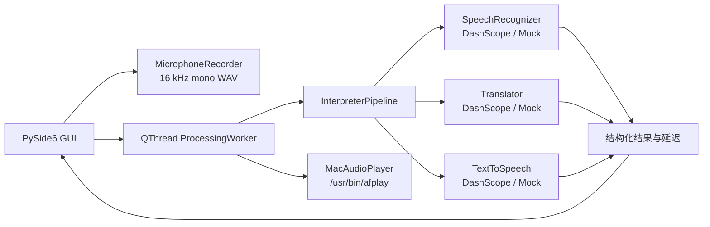

# AI Voice Interpreter

AI Voice Interpreter 是一个仅在 macOS 本机运行的 Python 桌面 MVP。当前版本完成的是**按句语音翻译**：用户录完一句中文后，应用依次执行语音识别、中文到英文翻译、英文语音合成，并自动播放结果。

> 当前版本不是连续、双向、全双工的同声传译，也不捕获会议软件或系统音频。

## 当前 MVP 能做什么

- 使用 Mac 麦克风录制 16 kHz、单声道、16-bit PCM WAV。
- 使用 DashScope `paraformer-realtime-v2` 识别已录制的中文语音。
- 使用 `qwen-mt-flash` 翻译为自然英文。
- 使用 `cosyvoice-v3-flash` 的系统音色或匹配的克隆音色生成英文 WAV。
- 通过 macOS 自带 `/usr/bin/afplay` 自动播放或重新播放。
- 显示识别文本、翻译文本、处理状态和 ASR/翻译/TTS/总延迟。
- 在后台 Qt 工作线程执行网络请求和播放，GUI 主线程不会被这些阻塞调用冻结。
- 使用完全离线的 Mock Provider 验证界面与端到端状态流。

当前不支持连续监听、边说边译、英文到中文反向翻译、系统音频捕获、虚拟声卡、Zoom/Teams/Meet 插件、多人会议、账号、数据库或支付。

## 架构



UI 只依赖 Pipeline 的结构化结果。Provider 接口与 DashScope SDK 原始返回对象隔离，因此后续可以替换实时 ASR、其他翻译模型或 TTS，而无需重写界面。

## 环境要求

- macOS，优先 Apple Silicon。
- Python 3.11–3.14。
- 可用麦克风和扬声器。
- 真实模式需要能访问阿里云百炼。

## 安装与启动

```bash
git clone https://github.com/27ruien/AI-Voice-Interpreter.git
cd AI-Voice-Interpreter
cp .env.example .env
make setup
# 编辑 .env，填写 DASHSCOPE_API_KEY 后再继续
make doctor
make run
```

`make setup` 创建 `.venv` 并安装运行和测试依赖。`make doctor` 先检查本机真实模式条件，之后通常只需 `make run`。

### Mock 模式

Mock 模式不需要 API Key，不发起网络请求：

```bash
make setup
make mock
```

仍需实际点击录音和停止，以验证麦克风、WAV 写入、Qt 工作线程、状态流和自动播放。Mock ASR/翻译会显示固定示例，Mock TTS 播放短测试音；界面会明确标注 Mock Mode，不会将其冒充真实 AI 结果。

## 真实模式诊断

填写 `.env` 后，建议先运行：

```bash
make doctor
```

等价命令是：

```bash
.venv/bin/python -m ai_voice_interpreter.doctor
```

Doctor **不会调用任何 ASR、翻译或 TTS 收费模型，也不会发起模型网络请求**。它使用 `PASS`、`WARN`、`FAIL` 检查 Python 版本、macOS、配置加载、API Key 是否存在（只显示已配置/未配置）、模型和音色、麦克风输入设备、`/usr/bin/afplay`、临时目录写权限及必要 Python 包。最后会明确说明是否满足真实模式启动条件。

## 配置真实模式

编辑 `.env`：

```dotenv
APP_MODE=real
# 在等号后填写北京地域 API Key，不要提交 .env
DASHSCOPE_API_KEY=
DASHSCOPE_REGION=beijing

ASR_PROVIDER=dashscope
ASR_MODEL=paraformer-realtime-v2
TRANSLATION_PROVIDER=dashscope
TRANSLATION_MODEL=qwen-mt-flash
TTS_PROVIDER=dashscope
TTS_MODEL=cosyvoice-v3-flash
# 留空时默认选择 longanyang（兼容 cosyvoice-v3-flash 与英文）
TTS_VOICE=
CLONED_VOICE_ID=
```

API Key 从[阿里云百炼控制台](https://bailian.console.aliyun.com/)创建。不同地域的 Key 不通用；默认配置使用北京地域。

### Workspace 与服务地址

如果使用 Workspace 专属域名，配置：

```dotenv
DASHSCOPE_WORKSPACE_ID=你的WorkspaceId
```

应用会生成以下北京地域地址：

- HTTP：`https://{WorkspaceId}.cn-beijing.maas.aliyuncs.com/api/v1`
- WebSocket：`wss://{WorkspaceId}.cn-beijing.maas.aliyuncs.com/api-ws/v1/inference`

如账号要求自定义端点，可分别设置 `DASHSCOPE_HTTP_BASE_URL` 和 `DASHSCOPE_WEBSOCKET_BASE_URL`，它们优先于自动生成的地址。未设置 Workspace 时使用 DashScope 仍可用的公共北京端点。详见[Paraformer Python SDK](https://help.aliyun.com/en/model-studio/paraformer-real-time-speech-recognition-python-sdk)和[Qwen-MT 文档](https://help.aliyun.com/zh/model-studio/machine-translation/)。

## 使用方式

1. 执行 `make run`。
2. 点击“开始录音”，对 Mac 麦克风说一句中文。
3. 至少录制约 0.35 秒，然后点击“停止并翻译”。
4. 等待“正在识别 → 正在翻译 → 正在生成语音 → 正在播放”。
5. 查看中英文文本和各阶段延迟；需要时点击“重新播放”。

录音和播放不会同时进行，以降低扬声器声音重新进入麦克风的风险。

## 麦克风权限

首次录音时 macOS 会请求麦克风权限。若没有出现提示或启动失败：

1. 打开“系统设置 → 隐私与安全性 → 麦克风”。
2. 允许启动应用所用的 Terminal、iTerm 或 Python。
3. 完全退出程序和终端后重新启动。

如果列表中没有对应程序，先执行一次“开始录音”触发权限请求。

## 系统音色

未设置 `CLONED_VOICE_ID` 时，应用使用 `TTS_VOICE`。若 `TTS_VOICE` 也留空，则集中配置的默认值是 `longanyang`；该音色与 `cosyvoice-v3-flash` 兼容并支持英文。可在[CosyVoice 音色列表](https://help.aliyun.com/en/model-studio/cosyvoice-voice-list)选择同一模型下支持英文的其他系统音色。

音色不能跨模型使用。更改 `TTS_MODEL` 时必须同时选择该模型支持的系统音色。

## 创建和使用克隆音色

只允许复刻你本人的声音，或已经获得声音所有者明确授权的声音。

准备一个公网可访问的音频 URL。建议 10–20 秒、至少 16 kHz、清晰连续人声、单一说话人、正常语速、安静环境且无背景音乐。支持的格式和限制以[声音复刻指南](https://help.aliyun.com/en/model-studio/voice-cloning-user-guide)为准。

```bash
.venv/bin/python -m ai_voice_interpreter.voice_enrollment \
  --audio-url "https://example.com/my-voice.wav" \
  --prefix myvoice \
  --language zh
```

工具使用当前 `TTS_MODEL` 作为 `target_model`，成功后输出 `voice_id` 和 `request_id`。将结果写入 `.env`：

```dotenv
TTS_MODEL=cosyvoice-v3-flash
CLONED_VOICE_ID=cosyvoice-v3-flash-myvoice-xxxxxxxx
```

也可追加 `--write-config`，将 `TTS_MODEL` 和 `CLONED_VOICE_ID` 写入 `~/.config/ai-voice-interpreter/config.env`。该文件权限设为仅当前用户可读写，且位于仓库外。环境变量与项目 `.env` 仍可覆盖它。

应用会检查克隆音色 ID 是否属于当前 `TTS_MODEL`。如果不匹配会明确失败，绝不会静默退回系统音色。官方 SDK 调用签名见[声音复刻 Python SDK](https://help.aliyun.com/zh/model-studio/voice-clone-python-sdk)。本工具不上传 OSS，只接受公网 URL。

## 测试和代码检查

```bash
make test
make lint
make doctor
```

等价命令：

```bash
.venv/bin/python -m pytest
.venv/bin/python -m ruff check .
```

测试全部使用 Mock 或注入的假服务，不调用收费 API。

## 延迟统计

- ASR、翻译、TTS 延迟：各 Provider 方法从发起调用到取得完整结果的本地墙钟耗时。
- 总延迟：Pipeline 从开始识别到 TTS 文件落盘的耗时。
- 播放时长不计入总处理延迟。

这些数值包含本机调度和网络传输时间，适合体验对比，不等同于服务端独立推理耗时。

真实模式 INFO 日志会记录每个阶段的开始/结束、模型、`request_id`、文本长度、空文本状态、生成音频路径和字节数、`afplay` 启动与退出结果，以及 ASR/翻译/TTS/总延迟。INFO 不记录 API Key，也不记录完整识别或翻译文本；克隆音色只记录为 `cloned` 模式，不记录完整音色 ID。

## 临时音频与隐私

默认 `KEEP_TEMP_AUDIO=false`。录音和生成音频存放在系统临时目录，只为当前应用会话的处理与重播保留，正常退出时清理。若为排障设为 `true`，录音会保留在临时目录，需由用户自行删除。

`.gitignore` 排除了 `.env`、虚拟环境、WAV、MP3、PCM 和 M4A。日志在 INFO 级别不记录完整识别或翻译文本，也不会记录 API Key 或原始音频；DEBUG 级别会记录文本，使用时注意隐私。真实模式会把录音内容发送到配置的 DashScope 服务处理。

## 常见错误排查

- **缺少 DASHSCOPE_API_KEY**：GUI 仍可启动并显示配置提示；填写 `.env` 后重启，或执行 `make mock`。
- **鉴权失败**：检查 API Key 是否属于所选地域，Workspace ID 和专属域名是否一致。
- **模型不存在/地域不匹配**：恢复 `.env.example` 中的模型名，并确认模型在北京地域可用。
- **音色不可用或 418 错误**：检查系统音色是否属于 `TTS_MODEL`；克隆音色必须使用创建时相同的 `target_model`。
- **额度不足/欠费**：到百炼控制台检查免费额度、余额和服务开通状态。
- **网络超时**：检查网络、代理、防火墙和自定义服务地址；默认请求超时配置为 45 秒。
- **未识别到语音**：靠近麦克风、提高输入音量并录制完整一句；检查 WAV 录音设备和权限。
- **无法播放**：确认运行环境是 macOS 且 `/usr/bin/afplay` 存在；生成文件被手动删除后不能重播。
- **声音复刻失败**：确认 URL 无鉴权且公网可下载，音频为 WAV 16-bit/MP3/M4A、≤10 MB，并含至少 5 秒连续清晰语音。

底层异常和 Provider `request_id` 会写入日志；界面只显示可操作的错误摘要，不显示完整堆栈。单次失败后可以重新开始录音。

## 当前架构限制与下一阶段

当前 Pipeline 在用户停止录音后依次执行三个完整请求，首包不会提前播放；录音、识别、翻译和合成都不是并行流式。当前只做中文到英文，且仍依赖网络服务。

下一阶段最优先任务是把 Paraformer 升级为麦克风音频分块实时识别，并加入 VAD/自动断句；保持现有 Provider 接口和按句模式作为稳定回退路径。在这一步稳定后，再考虑流式翻译、流式 TTS 和双向会议音频路由。
