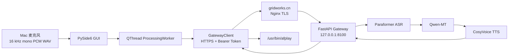

# AI Voice Interpreter

AI Voice Interpreter 是 macOS 上的中文到英文按句语音翻译 MVP。用户停止录音后，Mac 把 16 kHz 单声道 PCM WAV 上传到 HTTPS Gateway；服务器依次调用 DashScope Paraformer、Qwen-MT 和 CosyVoice，返回中英文文本与英文 WAV，Mac 下载后用 `/usr/bin/afplay` 播放。

> 当前仍是单向、按句、停止录音后处理的语音翻译 MVP，不是连续、双向、全双工同声传译。

## 三种运行模式

1. **Remote Gateway（产品默认）**：Mac 只配置 Gateway 地址与测试 Token，DashScope API Key 只存在服务器。
2. **Mock**：固定文本和本地测试音，不访问任何外部 API，用于界面与状态流回归。
3. **Local Direct（仅开发回退）**：Mac 直接调用 DashScope，必须显式配置 `INTERPRETER_MODE=local`，不作为产品默认。

当前不包含注册、支付、数据库、多用户、流式 ASR、VAD、双向翻译、系统音频捕获、虚拟声卡或会议软件接入。

## Client–Server 架构



服务器复用 `src/ai_voice_interpreter/providers/` 下的 Provider 和稳定 Pipeline。服务器镜像不安装 PySide6、录音或播放依赖。API Key 只在受保护的服务器 `server/.env` 中，避免桌面端代码、配置和分发包泄露供应商凭证。

## Mac 安装与配置

要求 macOS、Python 3.11–3.14、麦克风和扬声器。

```bash
git clone https://github.com/27ruien/AI-Voice-Interpreter.git
cd AI-Voice-Interpreter
cp .env.example .env
make setup
```

Remote 模式的本地 `.env` 只需：

```dotenv
APP_MODE=real
INTERPRETER_MODE=remote
AI_GATEWAY_BASE_URL=https://gridworks.cn/tool/ai-interpreter-api
AI_GATEWAY_TOKEN=

# Remote 模式必须保持为空
DASHSCOPE_API_KEY=
```

测试 Token 只适用于当前单用户 MVP，不等同于正式账号体系。不要把 `.env` 提交到 Git。

启动前诊断和运行：

```bash
make doctor
make run
```

Doctor 不发起网络模型请求，不产生费用。它检查 Python/macOS、依赖、配置、Gateway 地址与 Token 是否存在（不显示值）、本地 DashScope Key 是否缺失、麦克风、`afplay` 和临时目录。

首次录音时，在“系统设置 → 隐私与安全性 → 麦克风”允许启动应用的 Terminal、iTerm 或 Python；授权后完全退出并重新启动。

### Mock 模式

```bash
make mock
```

界面会明确显示 Mock Mode；仍需实际开始和停止录音，以覆盖麦克风、文件、Worker、状态和播放链路。

### Local Direct 开发回退

```dotenv
APP_MODE=real
INTERPRETER_MODE=local
DASHSCOPE_API_KEY=
DASHSCOPE_REGION=beijing
DASHSCOPE_WORKSPACE_ID=
DASHSCOPE_HTTP_BASE_URL=
DASHSCOPE_WEBSOCKET_BASE_URL=
ASR_MODEL=paraformer-realtime-v2
TRANSLATION_MODEL=qwen-mt-flash
TTS_MODEL=cosyvoice-v3-flash
TTS_VOICE=
CLONED_VOICE_ID=
```

`TTS_VOICE` 留空时，`cosyvoice-v3-flash` 默认使用支持中文和英文的系统音色 `longanyang`。Workspace 北京专属 HTTP 与 WebSocket 地址分别是 `https://{WorkspaceId}.cn-beijing.maas.aliyuncs.com/api/v1` 和 `wss://{WorkspaceId}.cn-beijing.maas.aliyuncs.com/api-ws/v1/inference`。Qwen-MT 使用仅含一个 user message 的专用 Native API 与 `translation_options`。

模型接口参考：[Paraformer Python SDK](https://help.aliyun.com/en/model-studio/paraformer-real-time-speech-recognition-python-sdk)、[Qwen-MT](https://help.aliyun.com/zh/model-studio/machine-translation/)、[CosyVoice 音色列表](https://help.aliyun.com/en/model-studio/cosyvoice-voice-list)和[非流式 TTS](https://help.aliyun.com/en/model-studio/non-realtime-tts-user-guide)。

## Gateway API

公网基址：`https://gridworks.cn/tool/ai-interpreter-api`

- `GET /healthz`：公开存活检查，不调用模型。
- `GET /readyz`：公开配置/临时目录/Provider 初始化检查，不调用模型。
- `POST /v1/interpret`：需要 `Authorization: Bearer <token>`；multipart 字段 `audio`、`source_language=zh`、`target_language=en`、可选 `voice` 和 UUID `request_id`。
- `GET /v1/audio/{uuid}`：使用同一 Bearer Token 下载 WAV。

Gateway 默认只接受最大 20 MB、单声道、16 kHz、16-bit PCM WAV，并发上限为 2。错误响应包含服务端 `request_id`。生成音频 UUID 不可预测，不通过公开静态目录暴露，默认 TTL 为 300 秒；过期后返回 404。

## Remote Smoke

准备中文测试音频：

```bash
say -v Tingting -o /tmp/ai-interpreter-test.aiff \
  "你好，我们今天主要讨论项目进度和下一步的交付计划。"
afconvert -f WAVE -d LEI16@16000 -c 1 \
  /tmp/ai-interpreter-test.aiff /tmp/ai-interpreter-test.wav
make remote-smoke
```

等价的完整入口：

```bash
.venv/bin/python -m ai_voice_interpreter.remote_smoke \
  --audio /tmp/ai-interpreter-test.wav \
  --verify-output --play
```

也支持 `--base-url`、`--token` 和 `--keep-files`。命令不会显示完整 Token；默认删除下载音频，保留文件时写入被 Git 忽略的 `remote-smoke-output/`。该命令拒绝 Mock 模式。

## 服务器部署

服务器配置模板是 `server/.env.example`。实际 `server/.env` 至少配置 Workspace API Key/ID、Native/Compatible Endpoint、MVP Token、模型、并发、TTL 和临时目录，并执行 `chmod 600 server/.env`。`.dockerignore` 和 `.gitignore` 都排除该文件。

```bash
cd /srv/ai-voice-interpreter
git pull --ff-only origin main
sudo docker compose -f server/compose.yaml build
sudo docker compose -f server/compose.yaml up -d
sudo docker compose -f server/compose.yaml ps
curl http://127.0.0.1:8100/healthz
```

Compose 项目固定为 `ai-voice-interpreter`，单 Uvicorn worker、非 root 容器用户，端口只绑定 `127.0.0.1:8100`。Nginx 片段位于 `deploy/nginx-ai-interpreter.conf`；必须加入现有 `gridworks.cn` HTTPS server block，先备份实际配置，再执行 `sudo nginx -t`，成功后只做 `sudo systemctl reload nginx`。

查看日志：

```bash
cd /srv/ai-voice-interpreter
sudo docker compose -f server/compose.yaml logs --tail=200 gateway
```

日志记录阶段、耗时、文件字节数和 request_id，不记录 API Key、Token、完整录音或默认 INFO 下的完整用户文本。

### 更新与回滚

更新前记录当前 commit 和 Nginx 备份；更新只允许快进：

```bash
git fetch origin main
git pull --ff-only origin main
sudo docker compose -f server/compose.yaml up -d --build
```

回滚时切回已记录的已知正常 commit，重新构建当前 Compose；若本轮改过 Nginx，则恢复带时间戳的备份，通过 `nginx -t` 后 reload。不要停止其他 Compose 项目，不要运行 `docker system prune`。

轮换 DashScope Key 时只更新服务器 `server/.env` 后重建 Gateway；轮换测试 Token 时同时更新服务器 `.env` 与 Mac 被忽略的 `.env`，再重建 Gateway。任何密钥都不得写入 Git、README、Dockerfile、Compose 或日志。

## 测试与检查

```bash
make test
make lint
make server-test
make server-lint
make doctor
bash -n run_mvp.sh
```

自动化测试使用 Mock/假 Pipeline/httpx MockTransport，不调用收费 API。Server 测试覆盖健康/就绪、鉴权、格式/大小、文件名隔离、失败短路、结构化错误、下载、TTL、并发和临时录音删除；Client 测试覆盖 multipart/Bearer、解析/下载、错误映射、超时、状态与清理。

## 临时音频与隐私

Mac 录音位于系统临时目录，应用退出时清理；远程 TTS 为重播临时保留，退出时清理。服务器在请求完成的 `finally` 中立即删除原始录音，仅在专用临时 Volume 中保留 UUID TTS 文件并按 TTL 删除。服务器不会把音频放入公开静态目录。

`.gitignore` 排除 `.env`、虚拟环境、缓存、日志、截图及 WAV/MP3/PCM/M4A 等音频。`KEEP_TEMP_AUDIO=true` 仅供本地排障，使用者需自行清理。语音会发送到配置的服务器和 DashScope Workspace 处理。

## 声音复刻开发回退

第一轮真实验收固定使用系统音色，不需要克隆音色。未来需要且已经获得声音所有者授权时，可在 Local Direct 配置下运行：

```bash
.venv/bin/python -m ai_voice_interpreter.voice_enrollment \
  --audio-url "https://example.com/my-voice.wav" \
  --prefix myvoice \
  --language zh
```

可追加 `--write-config` 写入仓库外的 `~/.config/ai-voice-interpreter/config.env`。克隆 ID 必须属于当前 `TTS_MODEL`，否则应用明确失败，不会静默降级。

## 当前限制

当前 Pipeline 在用户停止录音后依次执行完整 ASR、翻译和 TTS 请求，首包不会提前播放；只支持中文到英文。真实闭环稳定后，最高优先级才是麦克风分块流式 ASR 与 VAD，并保留按句模式作为稳定回退。
