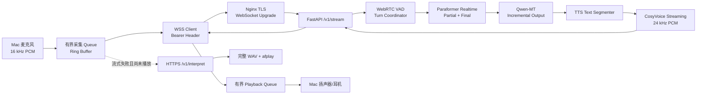

# AI Voice Interpreter

AI Voice Interpreter 是面向 macOS 的单向中文到英文语音翻译 MVP。产品默认使用 Turn-based Streaming：Mac 将麦克风的 16 kHz 单声道 PCM 按 100 ms 分块，经 WSS 发送到 Gateway；服务器通过 WebRTC VAD 划分 Turn，依次调用 Paraformer 实时识别、Qwen-MT 增量翻译和 CosyVoice 双向流式合成；Mac 接收 24 kHz PCM 后边收边播。

> 当前版本仍然是单向中文到英文的 Turn-based Streaming，不是双向全双工同声传译。建议使用耳机；当前没有声学回声消除。

## 运行模式

GUI 保留以下三种可验证模式：

1. **Remote Streaming（产品默认）**：`INTERPRETER_MODE=remote_stream`，音频通过 WSS 分块传输，支持 VAD、多 Turn、Partial 字幕、增量翻译和 PCM 流式播放。
2. **Remote One-shot**：`INTERPRETER_MODE=remote`，停止录音后通过 HTTPS `/v1/interpret` 上传完整 WAV，下载完整 TTS WAV 后使用 `/usr/bin/afplay` 播放；也是流式失败前尚未播放音频时的稳定回退。
3. **Mock**：`APP_MODE=mock`，固定文本与本地测试音，不调用任何外部 API。GUI Mock 使用按句链路；流式协议、VAD、多 Turn、播放队列、Benchmark 和 Soak 使用本机 Mock Server 自动验证。

`INTERPRETER_MODE=local` 仅作为开发诊断回退，Mac 会直接调用 DashScope，不是产品默认，也不应用于 Remote 验收。

## Client–Server Streaming 架构



DashScope API Key 只存在受保护的服务器 `server/.env`。Mac Remote 模式只需要 Gateway Token，不需要也不应配置 `DASHSCOPE_API_KEY`。

## Mac 安装与配置

要求 macOS、Python 3.11–3.14、麦克风和扬声器。

```bash
git clone https://github.com/27ruien/AI-Voice-Interpreter.git
cd AI-Voice-Interpreter
cp .env.example .env
make setup
```

产品默认配置：

```dotenv
APP_MODE=real
INTERPRETER_MODE=remote_stream
AI_GATEWAY_BASE_URL=https://gridworks.cn/tool/ai-interpreter-api
AI_GATEWAY_TOKEN=
DASHSCOPE_API_KEY=

ASR_MODEL=paraformer-realtime-v2
TRANSLATION_MODEL=qwen-mt-flash
TTS_MODEL=cosyvoice-v3-flash
TTS_VOICE=
CLONED_VOICE_ID=

STREAM_AUDIO_CHUNK_MS=100
STREAM_SEND_QUEUE_MAX_CHUNKS=50
STREAM_RING_BUFFER_SECONDS=30
STREAM_PLAYBACK_PREBUFFER_MS=150
STREAM_PLAYBACK_QUEUE_MAX_SECONDS=10
STREAM_PLAYBACK_SAVE_LAST_TURN=true
STREAM_CAPTURE_MODE=safe
STREAM_HTTP_FALLBACK=true
```

`TTS_VOICE` 为空且 `TTS_MODEL=cosyvoice-v3-flash` 时，代码选择兼容的系统音色 `longanyang`。真实验收使用系统音色，`CLONED_VOICE_ID` 保持为空。

启动：

```bash
make doctor
make run
```

Doctor 不发起网络模型请求，不产生费用，也不会显示 Key 或 Token 的值。它检查 Python/macOS、必要包、模式与模型配置、系统音色、Gateway 配置、Remote 模式未保存 DashScope Key、麦克风、`afplay` 和临时目录。

首次使用麦克风时，请在“系统设置 → 隐私与安全性 → 麦克风”允许 Terminal、iTerm 或 Python 访问，随后完全退出并重新启动应用。

### GUI 操作

- 选择“流式模式”后点击“开始同传”，讲话时可看到 ASR Partial；自然停顿后显示 ASR Final、Translation Partial/Final，并开始 PCM 播放。
- 点击“停止同传”会刷新当前 Turn、等待服务完成并释放连接，可再次开始新 Session。
- “按句模式”保留原有开始录音、停止并翻译、重新播放操作。
- GUI 显示连接、麦克风、VAD、Turn、Fallback，以及 First ASR Partial、Turn Finalization、Translation First Token、TTS First Audio、Client First Playback 和 Turn Total。

### Safe Mode 与 Headphones Mode

- **Safe Mode（默认）**：播放 TTS 时暂停麦克风，结束后恢复，降低扬声器回灌造成误触发的风险。
- **Headphones Mode**：播放期间继续采集，延续性更好，但应佩戴耳机。

当前没有自动声学回声消除。外放时优先使用 Safe Mode；连续采集时强烈建议耳机。

### Mock 与 Local Direct

```bash
make mock
```

Mock GUI 不调用外部 API。Local Direct 仅供开发：

```dotenv
APP_MODE=real
INTERPRETER_MODE=local
DASHSCOPE_API_KEY=
DASHSCOPE_REGION=beijing
DASHSCOPE_WORKSPACE_ID=
DASHSCOPE_HTTP_BASE_URL=
DASHSCOPE_WEBSOCKET_BASE_URL=
```

## WebSocket 协议

公网 WSS 地址由 Gateway 基址推导：

```text
https://gridworks.cn/tool/ai-interpreter-api
→ wss://gridworks.cn/tool/ai-interpreter-api/v1/stream
```

Token 只放在 `Authorization: Bearer ...` Header，不放在 URL Query、日志或控制消息中。连接后的首条客户端文本消息必须是协议 `1.0` 的 `session.start`，声明 `pcm_s16le`、16 kHz、单声道及分块时长；之后二进制 Frame 是原始 PCM。客户端还可发送 `ping` 和 `session.stop`。

服务端控制事件包括：

- `session.started` / `session.completed`
- `vad.speech_start` / `vad.speech_end`
- `asr.partial` / `asr.final`
- `translation.partial` / `translation.final`
- `tts.audio.start` / 二进制 PCM / `tts.audio.end`
- `turn.completed`、`warning`、`error`、`pong`

ASR Partial 只用于实时字幕，可能随 Provider 修订；只有一次 `asr.final` 会成为稳定 Source Turn。Qwen-MT 对稳定 Source Turn 调用一次，增量 Delta 经归一化后显示并送入 TTS Text Segmenter，避免重复翻译和重复合成。TTS 二进制块严格位于对应的 `tts.audio.start` 与 `tts.audio.end` 之间。

## VAD 与 Turn

服务器把客户端 100 ms Chunk 拆成 WebRTC VAD 支持的 20 ms Frame。默认参数：最短语音 250 ms、静音结束阈值 650 ms、Pre-roll 200 ms、单 Turn 最长 15 秒。Pre-roll 减少首字截断；自然停顿或最长时限结束 Turn；`session.stop` 会 Flush 正在进行的 Turn。

所有高频链路使用有界 Queue，包括采集、服务器输入、ASR 事件、翻译事件、TTS 文本、TTS 音频、播放和 Turn Queue。达到 80% 会记录 Warning，队列满会显式结束当前会话，不会无限等待或无限增长。

## Streaming TTS 与 PCM 播放

Qwen-MT 的增量英文按标点、目标长度、最大长度切段。CosyVoice 使用 `streaming_call()` 与 `streaming_complete()`，返回 24 kHz、单声道、16-bit PCM。Mac 在独立播放线程中预缓冲约 150 ms 后写入 SoundDevice RawOutputStream；网络回调和 GUI 主线程都不直接执行音频设备 I/O。最后一轮可保存为临时 WAV 供重播，应用退出时清理。

官方接口参考：[Paraformer 实时识别 SDK](https://help.aliyun.com/en/model-studio/paraformer-real-time-speech-recognition-python-sdk)、[Qwen-MT 增量翻译](https://help.aliyun.com/en/model-studio/machine-translation)、[CosyVoice 流式合成 SDK](https://help.aliyun.com/en/model-studio/cosyvoice-python-sdk)。

## HTTP Fallback

现有 `/v1/interpret` 保持可用。流式连接已建立、当前 Ring Buffer 有音频且尚未播放任何流式 TTS 时，如果 Provider、WebSocket 或客户端背压失败，客户端会：

1. 将当前 Ring Buffer 写为临时 WAV；
2. 调用现有 HTTPS One-shot；
3. 下载完整 WAV 并使用 `afplay`；
4. GUI 明确显示 `HTTP Fallback`；
5. 删除 Ring Buffer 临时 WAV。

如果当前 Turn 已经播放过部分流式 TTS，不会自动重播完整句，以免重复音频；Session 会明确失败，用户可在下一轮切换按句模式。WSS 在采集开始前就无法建立时没有当前 Turn 可回退，GUI 会显示连接错误并允许直接选择按句模式。Fallback 不是静默降级。

## Smoke、Benchmark 与 Soak

创建确定性测试音频：

```bash
say -v Tingting -o /tmp/ai-interpreter-stream-test.aiff \
  "你好，我们今天主要讨论项目进度和下一步的交付计划。"
afconvert -f WAVE -d LEI16@16000 -c 1 \
  /tmp/ai-interpreter-stream-test.aiff /tmp/ai-interpreter-stream-test.wav
```

真实时间节奏的文件 Streaming Smoke：

```bash
make stream-smoke
```

等价入口支持 `--base-url`、`--token`、`--audio`、`--microphone`、`--duration`、`--play`、`--keep-files`、`--repeat`、`--safe-mode`、`--headphones-mode`、`--max-turns` 和 `--json-report`。命令不会输出完整 Token；报告和音频目录均被 Git 忽略。

无收费 Mock Benchmark：

```bash
make stream-benchmark
```

输出 `benchmark-output/stream-benchmark.json` 和 `.md`。报告明确标记 `mock_streaming`，只用于本机回归，不代表真实网络性能。

30 分钟无收费稳定性测试：

```bash
make stream-soak
```

它持续模拟完整 WSS Turn，检查成功率、Tracemalloc 内存窗口、线程恢复和临时文件残留，报告写入被忽略的 `soak-output/`。短时开发检查可使用 `make stream-soak SOAK_MINUTES=0.1`，但不能代替正式 30 分钟验收。

## 性能指标

- `asr_first_partial_ms`：首个真实语音 Frame 到首个 ASR Partial。
- `turn_finalize_ms`：实际语音结束到稳定 ASR Final，包含 VAD 静音判定等待。
- `translation_first_token_ms`：翻译请求开始到首个增量 Token。
- `tts_first_audio_ms`：首段 TTS 文本送出到服务端首个 PCM。
- `client_first_playback_ms`：客户端估算的实际语音结束到首次设备写入。
- `server_time_to_first_audio_ms`：服务端实际语音结束到首个下行 PCM。
- `end_to_end_ttfa_ms`：客户端估算的语音开始到首次设备写入。
- `turn_total_ms`：Turn 被 VAD 激活到翻译与音频发送完成。

服务器与 Mac 使用各自 Monotonic Clock，不直接相减。真实报告保留服务端相对耗时与客户端相对耗时。

## Gateway API

公网基址：`https://gridworks.cn/tool/ai-interpreter-api`

- `GET /healthz`：公开存活检查，不调用模型。
- `GET /readyz`：公开配置、临时目录和 Streaming 状态检查，不调用模型。
- `WSS /v1/stream`：Bearer Header 鉴权的流式入口。
- `POST /v1/interpret`：Bearer Header 鉴权的完整 WAV One-shot。
- `GET /v1/audio/{uuid}`：使用同一 Token 下载临时 TTS WAV。

HTTP Gateway 默认最大上传 20 MB、并发 2、TTS 文件 TTL 300 秒。WSS 默认总连接 2、同一 Token 连接 1、会话最长 3600 秒、心跳超时 60 秒、单 Frame 最大 65536 bytes。结构化错误会带 Error Code、Session/Turn/Request ID，但不会包含 Key 或 Token。

## Nginx WebSocket 配置

仓库提供：

- `deploy/nginx-websocket-map.conf`：安装到 Nginx `http` context（通常 `/etc/nginx/conf.d/`），定义 `$connection_upgrade`。
- `deploy/nginx-ai-interpreter.conf`：包含精确 WSS location 和原有 HTTP prefix location，放入现有 `gridworks.cn` HTTPS server block。

修改前将实际配置备份到 `/etc/nginx/backups/`，不要把备份放进 `sites-enabled`。必须先执行：

```bash
sudo nginx -T
sudo nginx -t
sudo systemctl reload nginx
```

WSS location 使用 HTTP/1.1 Upgrade、`$connection_upgrade`、3600 秒读写超时并关闭代理缓冲。不得修改证书、ProjectAI location 或其他应用的 upstream。

## 服务器部署与回滚

服务器配置模板为 `server/.env.example`。实际 `server/.env` 必须 `chmod 600`，配置 Workspace Key/ID、Native/Compatible Endpoint、MVP Token、模型与 Streaming 参数；Key 和 Token 不得进入 Git。HTTP 按句识别使用 `ASR_MODEL=paraformer-v2`，实时识别独立使用 `STREAM_ASR_MODEL=paraformer-realtime-v2`，不得用实时模型覆盖 HTTP Fallback 的文件识别模型。

```bash
cd /srv/ai-voice-interpreter
git pull --ff-only origin main
sudo docker compose -f server/compose.yaml build
sudo docker compose -f server/compose.yaml up -d
sudo docker compose -f server/compose.yaml ps
curl http://127.0.0.1:8100/healthz
curl http://127.0.0.1:8100/readyz
```

Compose 项目名固定为 `ai-voice-interpreter`，单 Uvicorn Worker，容器使用非 root 用户，端口只绑定 `127.0.0.1:8100`。原始 WSS PCM 只在内存中传递，不在服务器落盘；Streaming TTS PCM 直接下行，不产生长期文件。HTTP One-shot 的上传在 `finally` 立即删除，TTS WAV 按 TTL 清理。

部署前记录旧 commit、Docker 状态、ProjectAI 状态和 Nginx 备份。若 Streaming 失败但 HTTP 正常，可在服务器 `.env` 设置 `STREAMING_ENABLED=false` 并只重建 Gateway；无需停止 ProjectAI。完整回滚时恢复已记录 commit 和 Nginx 备份，重建该 Compose，通过 `nginx -t` 后 reload。不要 force push、不要运行全局 Docker prune、不要操作其他 Compose 项目。

## 测试与提交前检查

```bash
make test
make lint
make server-test
make server-lint
make stream-test
make doctor
bash -n run_mvp.sh
.venv/bin/python -c "import ai_voice_interpreter; print('import ok')"
```

自动化测试只使用 Mock/Fake，不调用收费 API，覆盖协议、鉴权、VAD、Stop Flush、Partial/Final、增量归一化、TTS 分段、二进制音频、连接与 Frame 限制、有界采集/播放队列、HTTP Fallback、不重复播放、临时文件清理，以及原有 HTTP、TTL、Doctor、GUI Worker 回归。

## 临时音频、日志与隐私

`.gitignore` 和 `.dockerignore` 排除 `.env`、虚拟环境、缓存、日志、截图、音频、Smoke、Benchmark 和 Soak 输出。Mac Ring Buffer 默认只在内存保留最近 30 秒；Fallback 临时 WAV 用完即删；最后一轮重播 WAV 在应用退出时清理。`KEEP_TEMP_AUDIO=true` 或 `--keep-files` 只供本地排障，使用者负责清理。

INFO 日志只记录 ID、状态、文本长度、字节数、队列深度和耗时，不记录完整用户语音内容、API Key 或 Token。语音会发送到配置的 Gateway 和 DashScope Workspace 处理。

## 声音复刻开发接口

本轮真实验收固定使用系统音色，不执行声音复刻。未来在已获得声音所有者授权、Local Direct 配置完整时，可运行：

```bash
.venv/bin/python -m ai_voice_interpreter.voice_enrollment \
  --audio-url "https://example.com/my-voice.wav" \
  --prefix myvoice \
  --language zh
```

可加 `--write-config` 写入仓库外的 `~/.config/ai-voice-interpreter/config.env`。克隆 ID 必须属于当前 `TTS_MODEL`，否则配置检查会失败。

## 常见错误

- `4401`：Bearer Token 缺失或错误；检查 Mac 与服务器 Token 是否一致，不要在命令输出中打印值。
- `4403`：服务器关闭了 Streaming；切换按句模式或检查 `STREAMING_ENABLED`。
- `4429`：总连接或同 Token 连接达到上限；结束旧 Session 后重试。
- `PROTOCOL_VERSION_UNSUPPORTED`：客户端和服务器协议版本不一致。
- `HEARTBEAT_TIMEOUT`：网络中断或客户端停止发送心跳。
- `SERVER_BACKPRESSURE` / `CLIENT_BACKPRESSURE`：有界队列已满；停止本轮并切换按句模式排查。
- `ASR_*`、`TRANSLATION_*`、`TTS_*`：对应 Provider 阶段失败；记录 Error Code 和 Request ID，不记录凭证。

## 当前限制

当前版本是单向中文到英文的 Turn-based Streaming 语音翻译 MVP。它不是双向、全双工同声传译；建议使用耳机，当前没有声学回声消除。

本版本不包含用户系统、支付、数据库、系统音频捕获、虚拟声卡、会议软件接入、端到端 LiveTranslate、声学回声消除、声音 Profile 管理或 Mac 安装包。多 Turn 以 VAD 划分并顺序处理，Translation 和 TTS 从稳定 ASR Final 开始，不是单词级全双工翻译。
